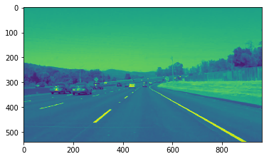
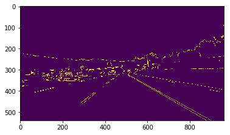
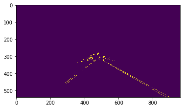
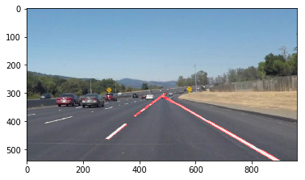
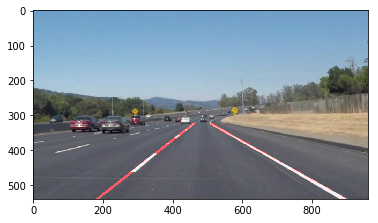

# **Finding Lane Lines on the Road** 

## Write-up


### **Goal**

The goal of this project:

- Develop a pipeline that finds lane lines on the road.


----------------------
### **Steps to approach the problem**

I worked with this project in two main steps:
- First I started-off with the easier problem which was working with the following image:


- Then, once I got my pipeline working with it fine I went on to test it with the videos located in **`\test_videos`**


---------------------------------------------------------------------------------

### Reflection

##### Pipeline Description:
1. **Image Read:** First, I read the image from the path it's located and show it.
   
```
import os


INPUT_IMAGES_PATH = "test_images/"
OUTPUT_IMAGES_PATH = "test_images_output/"
files = os.listdir(INPUT_IMAGES_PATH)

for file in files:
# to speed up testing we try with one image
    if file != "solidWhiteCurve.jpg": 
        break
     
    image = mpimg.imread(INPUT_IMAGES_PATH  + file)
    plt.figure()
    plt.imshow(image)
```
The image will be shown as below in nice x & y graph which will be helpful while playing with it next :


2. **ROI Definition:** Detecting the size of image, then define the ROI which is the lane I would be marking its boarder later, by defining 3 points forming triangular shape.


```python
height = image.shape[0]
width = image.shape[1]
region_of_interest_vertices = [
           (0, height),
           (width / 2, height / 2),
           (width, height),]
```

3. **Gray-scale:** Converting the image to gray-scale to cut off the information it holds about colors since we care all about the intensity of pixels not the colors information when we we are about to detect the lane lines.   

```python
gray_image = cv2.cvtColor(image, cv2.COLOR_RGB2GRAY)
plt.figure()
plt.imshow(gray_image)
```




4. **Canny Edge Detection:** In order to detect the lines in the image I used Canny algorithm for edge detection, essentially it's working on detecting the strong gradients by the help of pair threshold (min-threshold = 100) and (max-threshold = 200)


```python
cannyed_image = canny(gray_image, 100, 200)
plt.figure()
plt.imshow(cannyed_image)
```


5. **ROI Cropping:** Now we have an image that has areas of edges(which rapidly change over the intensity value for each pixel) but also we have other noisy edges scattered around, it's time to crop the ROI to focus on it with the help of points we defined before **`region_of_interest_vertices`**.

```python
cropped_image = region_of_interest(
        cannyed_image,
        np.array(
            [region_of_interest_vertices],
            np.int32
        ),
    )
```


6. **Line Detection** In order to generate lines from the pixels forming edges in the last image I used Hough Line Transform algorithm which essentially transform the points in image space to lines in hough space and then voting lines by the intersection formed between those lines. 

```python
lines = cv2.HoughLinesP(
        cropped_image,
        rho=6,
        theta=np.pi / 60,
        threshold=160,
        lines=np.array([]),
        minLineLength=40,
        maxLineGap=25
    )
print(lines)
line_image = draw_lines(image, lines);    
```
output of houghline transform are coordinates of lines x1,y1, x2,y2 to form the
line segments.


```python
[[[483 311 878 539]]

 [[647 399 716 438]]

 [[704 430 806 488]]
.....]]
```

that when passed to **`drawLines`** function will plot them on the image to look like below:




7. **Connecting Lines:** Now I have line segments queued along the right & left lanes but the goal is to generate one **single connected line** along the lane on both right and left sides.
In order to achieve that we need to use **mathematical linear model** to fit a line for each side by using its line segment group already detected.

    But the problem that I have all line coordinates stored on **`lines`** without
    differentiation between the right|left groups, to solve this problem I used the slope value to group them accordingly.

```python
left_line_x = []
left_line_y = []
right_line_x = []
right_line_y = []
for line in lines:
    for x1, y1, x2, y2 in line:
        slope = (y2 - y1) / (x2 - x1) # <-- Calculating the slope.
        if math.fabs(slope) < 0.5: # <-- Only consider extreme slope
            continue
        if slope <= 0: # <-- If the slope is negative, left group.
            left_line_x.extend([x1, x2])
            left_line_y.extend([y1, y2])
        else: # <-- Otherwise, right group.
            right_line_x.extend([x1, x2])
            right_line_y.extend([y1, y2])
```


Now I ended-up with **`left_line_x`** which has the **`x`** points of the left line and **`left_line_y`** which has the **`y`** points of the left line and same for the right line.

Then I define the start and end point for the line in the `y-axis` as  how long the lines will extend

```python
min_y = int(image.shape[0] * (3 / 5)) #  Just below the horizon
max_y = int(image.shape[0]) #  The bottom of the image
```
To fit a line on both sides I used **`polyfit`** and **`poly1d`** to develop a function that can take y values `(min_y, max_y)` and return their x values `f(y) = x`
to finally have the coordinates of the start and end points for the line on both sides in form of x1,y1 x2,y2

<u>***Note***</u>: I reversed the order of y and x while feeding to **`polyfit`**  
`p.polyfit(
       left_line_y,
       left_line_x,
       deg=1
   )`

since we have **`y`** and expecting to get values for **`x`**  


```python
poly_left = np.poly1d(np.polyfit(
       left_line_y,
       left_line_x,
       deg=1
   ))
left_x_start = int(poly_left(max_y))
left_x_end = int(poly_left(min_y))
poly_right = np.poly1d(np.polyfit(
   right_line_y,
   right_line_x,
   deg=1
))
right_x_start = int(poly_right(max_y))
right_x_end = int(poly_right(min_y))
print(poly_left)
```

for example: the output of printing **`poly_left`** will be 
**`-1.288 x + 878.5`**  this is the solve of y = mx + b for the left line, so on happens with the right line, using those equations x can be solved by using
**`left_x_start = int(poly_left(max_y))`**

after the above code I got **`left_x_start`** , **`left_x_end`** , **`right_x_start`** , **`right_x_end`** which are x1,x2 for both righ and left
and I already have the accordingle **`y`** values, which means I have finally got the full two coordinates (x1,y1 x2,y2) to draw line between in both left and right sides.

```python
line_image = draw_lines(
        image,
        [[
            [left_x_start, max_y, left_x_end, min_y],
            [right_x_start, max_y, right_x_end, min_y],
        ]],
        thickness=5,
    )
plt.figure()
plt.imshow(line_image)
plt.show()
```





7. Finally writing the result image to output path
```python
r,g,b = cv2.split(line_image)
result = cv2.merge((b,g,r))
cv2.imwrite(OUTPUT_IMAGES_PATH + file, result)
```

8. Now I am ready to test my pipeline with video by encapsulating the above code into a function named **`process_image`**
and using it from inside the below code

```python
white_output = 'test_videos_output/solidWhiteRight.mp4'
clip1 = VideoFileClip("test_videos/solidWhiteRight.mp4")

white_clip = clip1.fl_image(process_image)
```


The pipeline worked fine with the following videos:
- solidWhiteRight.mp4
- solidYellowLeft.mp4

The output videos are located inside **`test_videos_output`** folder, Also for output images are located inside **`test_images_output`**

---------------------------------------------------------------------------

### Shortcomings

- When testing the pipeline with the challenge video it crashed in some frames
when the lane lines started to get curvy or either gets deviated because the model I followed with extrapolating the line was linear model which is best fitting with straight line but when it comes to curved lines the slope will not be constant along the line and it would be difficult to differentiate the right from the left side.

### 3. Suggested Improvement

I think the improvement will go in two directions, 
- the first finding new way to differentiate between the right/left side lines instead of slopes since the slope in some frames will be same when it gets curvy.
- second direction is to change the degree of the fitting polynomial used with the **`polyfit`** function from 1 degree to 3 degree to fit curvy line


